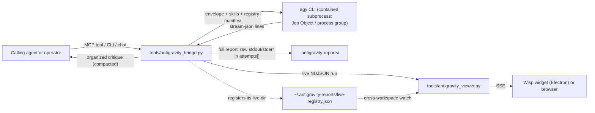

# Wisp

Wisp turns the Google Antigravity CLI (`agy`) into a delegated adversarial verification sub-agent for any coding harness — opencode, Claude Code, Codex, Cline, or a plain script. It packages the delegation as an MCP server and a CLI, normalizes Antigravity's machine-readable stream into an organized critique, keeps the complete forensic record on disk, and mirrors every run in a floating desktop widget with a chat channel for quick operator questions.

The dilemma it resolves is structural: an agent that wrote the code cannot neutrally grade it, and Antigravity's raw output is hostile to consumers — a single 180-step review produced **426 KB** of `stream-json`, most of it lifecycle traffic, with the actual verdict buried at the end. Wisp holds the adversarial contract (envelope, skill selection, claims to falsify), extracts and organizes the real critique — compacting the wire representation without imposing a hard output ceiling — while retaining every raw byte in the on-disk forensic record.

[](LICENSE)
[](https://www.python.org/downloads/)


---

## How it works



The bridge spawns `agy` inside an OS containment boundary (Windows Job Object with kill-on-close; POSIX process group), streams and captures stdout/stderr in full, retries transient failures, fails over to the fallback model on quota exhaustion, and persists one complete JSON report per delegation. The MCP server is a thin stdio wrapper over the same engine; the viewer is optional and read-only with respect to the engine.

---

## Quickstart

Windows (from a clone; `setup.bat` handles Python, the venv, dependencies, the `agy` check, registry validation, and the test suite):

```powershell
git clone <your-fork-url> wisp
cd wisp
setup.bat
.venv\Scripts\python tools\antigravity_bridge.py --status
.venv\Scripts\python tools\antigravity_bridge.py --prompt "Harden this migration plan" ^
    --context "SQLite WAL, single writer" ^
    --claim "No migration exceeds 5 seconds" ^
    --artifact "migrations/0042_add_index.sql" ^
    --skills adversarial-plan-hardening-engine
```

macOS / Linux:

```bash
python3 -m venv .venv && . .venv/bin/activate
pip install -r requirements-dev.txt
python -m tools.skill_loader --validate
python -m pytest tests/ -q
python tools/antigravity_bridge.py --status
```

Prerequisites: Python 3.10+, a signed-in Google Antigravity CLI (`agy`), and Node.js only if you want the desktop widget (one-time `npm install` in `tools/wisp_shell`, performed by `setup.bat` when npm is present). The bridge resolves `agy` from `PATH`, then `~/.gemini/bin`; `--executable <path>` overrides.

A dry run prints the exact command and payload without invoking `agy`:

```bash
python tools/antigravity_bridge.py --dry-run --prompt "..." --skills all
```

---

## The delegation contract

An envelope describes the review; every field is optional except `prompt`.

| Field | Meaning |
| --- | --- |
| `prompt` | The plan, diff summary, question, or claim set under review. Required. |
| `context` | Prior art, constraints, failed attempts, environment facts. |
| `claims_to_falsify` | Itemized assertions Antigravity must disprove or confirm with evidence. |
| `artifacts` | Workspace-relative paths (`src/scheduler.py:45-120`). Paths only — Antigravity reads the mounted workspace itself. |
| `skills` | The necessary/primary skills to activate (names or `"all"`); rendered as mandatory instructions. |
| `recommended_skills` | Up to three task-dependent skills; rendered as apply-when-relevant. More than three is a validation error. |
| `notes` | Operator steering that must not be ignored. |

The payload always carries the **full registry manifest** (name, version, description, triggers, source path) so Antigravity can read any additional skill in full from the mounted registry. When a workspace has no `Skills/` directory, the shipped registry is used, mounted via an extra `--add-dir`, and the fallback is recorded as a warning in the report.

Via MCP, the same contract is exposed as `antigravity_review` (plus `antigravity_status` and `antigravity_skills`):

```json
{
  "prompt": "Harden this plan before execution: ...",
  "context": "SQLite WAL, single writer",
  "claims_to_falsify": ["No migration exceeds 5 seconds"],
  "artifacts": ["migrations/0042_add_index.sql"],
  "skills": ["adversarial-plan-hardening-engine"],
  "recommended_skills": ["data-contract-state-integrity-engine"]
}
```

---

## What comes back

For every delegation, the bridge persists a complete report under `<workspace>/.antigravity-reports/antigravity-report-<timestamp>-<id>.json`:

- **The organized critique** — the final `result.response` leads as `Findings & Response`; streamed per-step text is coalesced; tool names are tallied; lifecycle beacons collapse into a compact digest (step counts, session init, notable steps, result status).
- **Complete raw streams** — the untouched `stdout` and `stderr` of every attempt live in `attempts[]`; nothing is discarded on disk.
- **The MCP tool response** — the organized critique plus `stream_stats` (character counts per stream) and the report path, so callers get a compacted, readable payload and the raw record stays retrievable.

Observed on a real 180-step run: `426,063` characters of raw stdout became a `45,409`-character organized critique with the verdict intact; the pre-fix aggregator emitted `432,855` characters that were mostly raw-stream duplicate.

The bridge CLI `--json` prints the full result including both raw streams; the report file is the authoritative forensic record.

---

## The live viewer and widget

`tools\antigravity_viewer.cmd` starts a local server and a frameless Electron widget (browser fallback when the shell is not installed). The widget follows the newest run across **every registered workspace** — each live-enabled delegation records its live directory in `~/.antigravity-reports/live-registry.json`, so runs triggered from other repositories appear in the stream, History, and replay.

Six views, sized to a fixed transparent canvas and switchable by click, keyboard (`1`–`6`), or the cradle navigation in the Wisp tab:

| View | Content |
| --- | --- |
| Wisp | The companion; hover reveals the mode cradle |
| Focus | Live digest of the latest thoughts |
| Stream | The full reasoning trail, markdown-rendered, path badges, entry counts |
| Chat | Operator chat: quick asks, attachments (paste images), thread history, run details |
| Verdict | Run telemetry (thoughts/tools/retries/elapsed), pass/fail banner, run info, replay |
| History | Conversations (pin/unpin) and archived runs, labelled by workspace |

Operator hotkeys: `Ctrl+Alt+Q` sends the current selection (or opens a snip) as a quick ask; `Ctrl+Alt+E` pre-fills the chat composer with the capture instead of sending. The same two flows are available as buttons in the widget header. Three themes (Ember, Aurora, Moss) are selectable in Settings and persisted per user.

The chat asks and the MCP server share one engine but are configured independently: the Settings "Wisp Asks" toggle applies only to chat/hotkey asks; MCP delegations use the skills their calling agent passes.

---

## Skill registry

`Skills/` holds the adversarial skill definitions — Markdown with YAML front matter, or YAML. Every definition must carry `name`, `version`, `description`, `activation_triggers`, `input_contract`, `output_contract`, and `instructions_payload`.

```bash
python -m tools.skill_loader --validate      # fail loudly on contract violations
python tools/antigravity_bridge.py --list-skills
```

Twelve skills ship with the repository, covering plan hardening, AST/wiring audits, empirical falsification, surgical patching, data contracts, AI evals, runtime security, telemetry, portability, documentation accuracy, retrieval grounding, and agentic tool orchestration. `--skills all` activates the full non-template registry; `kind: template` files are never auto-selected. The v3.0.0 rewrite provenance — defects found, fixes applied, validation evidence — is documented in [`docs/skills-repair-report.md`](docs/skills-repair-report.md).

---

## Register the MCP server

The server speaks MCP v1 over stdio; stdout carries protocol frames only, all diagnostics go to stderr. Register it once per harness — harnesses spawn and terminate it automatically.

- **opencode** — already configured in this repository's `opencode.json` (`python tools/antigravity_mcp_server.py`, long tool timeout).
- **Universal launcher** — `tools\antigravity_mcp.cmd` resolves the repository root, pins the model chain, and starts the server.
- **Claude Code** — `claude mcp add antigravity -- cmd.exe /c "<repo-root>\tools\antigravity_mcp.cmd"` (adjust the path to your clone).
- **Codex** (`~/.codex/config.toml`):
  ```toml
  [mcp_servers.antigravity]
  command = "cmd.exe"
  args = ["/c", "<repo-root>\\tools\\antigravity_mcp.cmd"]
  ```
- **Cline / Roo / Cursor** — their MCP settings JSON:
  ```json
  { "mcpServers": { "antigravity": { "command": "cmd.exe", "args": ["/c", "<repo-root>\\tools\\antigravity_mcp.cmd"] } } }
  ```

`AGENTS.md` defines the mandatory delegation gates (plan generation, high-risk seams, pre-commit audit, repeated failure) and the reconciliation rules the calling agent must follow; `AgentSkill.md` and `.opencode/skills/antigravity-delegation/SKILL.md` carry the agent-facing operating protocol.

---

## Configuration

Environment variables are read by the MCP server, the viewer, and the launchers. All are optional.

| Variable | Effect | Default |
| --- | --- | --- |
| `ANTIGRAVITY_WORKSPACE` | Workspace root mounted for reviews | current working directory |
| `ANTIGRAVITY_SKILL_DIR` | Explicit skill registry directory | `<workspace>/Skills`, falling back to the shipped `Skills/` |
| `ANTIGRAVITY_LIVE` | Live event emission (`0` disables) | `1` |
| `ANTIGRAVITY_LIVE_DIR` | Live NDJSON directory | `<workspace>/.antigravity-reports/live` |
| `ANTIGRAVITY_LIVE_KEEP` | Live run files retained | `20` |
| `ANTIGRAVITY_LIVE_REGISTRY` | Cross-workspace live registry path | `~/.antigravity-reports/live-registry.json` |
| `ANTIGRAVITY_MODEL` | Primary model | `gemini-3.8-flash-high` |
| `ANTIGRAVITY_FALLBACK_MODEL` | Quota failover model | `claude-opus-4-6-thinking` |
| `ANTIGRAVITY_HARNESS` | Harness tag recorded in the envelope | per launcher |
| `ANTIGRAVITY_PRINT_TIMEOUT` | `agy --print-timeout`, seconds | `1200` |
| `ANTIGRAVITY_RETRIES` | Transient-failure retries per model | `2` |
| `ANTIGRAVITY_RETRY_BACKOFF` | Base seconds for retry backoff | `5` |
| `ANTIGRAVITY_QUOTA_WAIT` | Max seconds to wait for a quota reset | `0` (never wait) |
| `ANTIGRAVITY_QUOTA_HOOK` | Command run on quota exhaustion (account rotation) | unset |

Additional CLI flags: `--model`, `--fallback-model`, `--print-timeout`, `--grace-seconds`, `--retries`, `--retry-backoff`, `--quota-wait`, `--quota-hook`, `--live/--no-live`, `--executable`, `--json`, `--dry-run`, `--status`, `--list-skills`.

---

## Verification

Deterministic suite — offline by design; no test invokes `agy`, no network, no credentials:

| Check | Command | Observed |
| --- | --- | --- |
| Test suite | `python -m pytest tests/ -q` | all green in `~90 s` |
| Skill registry | `python -m tools.skill_loader --validate` | `12 skills`, `0 warnings` |
| Bridge status | `python tools/antigravity_bridge.py --status` | resolves executable, workspace, registry, models |

Testbed: Windows 11, CPython 3.13, single workstation. The suite is deterministic by construction — scripted launchers replace `agy`, and the live registry is isolated per test.

Real delegations, recorded as **single observations** (N=1) on the same workstation — not controlled benchmarks:

| Run | Model chain | Steps | Wall time | Raw stdout | Organized critique |
| --- | --- | --- | --- | --- | --- |
| Plan hardening | `gemini-3.8-flash-high` | 85 | `213.4 s` | `229,093` chars | `35,069` chars (report) |
| Deployment audit | `gemini-3.8-flash-high` | 180 | `374.8 s` | `426,063` chars | `45,409` chars |

Long runs reflect the underlying agent loop (dozens of tool steps per review), not bridge overhead; the bridge itself adds aggregation and report writing measured in milliseconds. Multi-seed sweeps have not been run.

---

## Boundaries and non-goals

- **Windows-first.** Selection/snip capture and the Electron widget are Windows implementations (Win32 clipboard, native window drag regions). The bridge, MCP server, skill loader, aggregation, and live feed are OS-agnostic; the viewer falls back to a browser where the shell is unavailable.
- **Antigravity required.** `agy` must be installed and signed in; quota exhaustion fails over to the fallback model or fails loudly with the reset window preserved in the report. Wisp does not manage Google credentials.
- **Aggregation is heuristic.** The final `result.response` is authoritative and leads the critique; streamed text is coalesced per step; lifecycle beacons are summarized, not reproduced. The complete raw streams are always retained in `attempts[]` — if the organized view ever misleads, the forensic record is one field away.
- **CI included.** `.github/workflows/ci.yml` runs the deterministic suite (ruff, `compileall`, skill-registry validation, Node syntax check, pytest) on Windows + Ubuntu across Python 3.10/3.13; no run touches real `agy` or quota.
- **The viewer is optional.** The delegation engine and MCP server work identically whether or not the viewer process is running.
- **Not a sandbox for untrusted code.** The containment boundary governs the `agy` process tree (Windows: suspended start, Job Object assignment, and taskkill tree termination; POSIX: session process group), not the model's outputs or its granted authority; treat reviews as advice, not execution. Full trust model: `SECURITY.md`.

---

## Repository layout

```
tools/
  antigravity_bridge.py        delegation engine: containment, retries, quota failover,
                               stream aggregation, reports
  antigravity_mcp_server.py    MCP v1 stdio server (antigravity_review/status/skills)
  antigravity_live.py          live event feed, stream parser, cross-workspace registry
  antigravity_viewer.py        local viewer server (SSE, chat, captures)
  antigravity_viewer.html      widget UI (six views, cradle navigation, themes)
  skill_loader.py              registry discovery, validation, prompt/manifest rendering
  wisp_capture.py              selection/snip capture (Win32 + PowerShell fallback)
  wisp_chat.py                 persistent chat threads for operator asks
  wisp_shell/                  Electron shell (npm install once; optional)
  capture/                     PowerShell capture helpers
Skills/                        adversarial skill registry (12 skills)
tests/                         deterministic suite (300+ tests)
docs/                          skills repair provenance log
images/                        creature art source masters
AGENTS.md                      delegation gates and reconciliation rules
AgentSkill.md                  agent-facing delegation protocol
setup.bat                      Windows bootstrap: venv, deps, agy check, validation, tests
```

## License

MIT — see [LICENSE](LICENSE).
