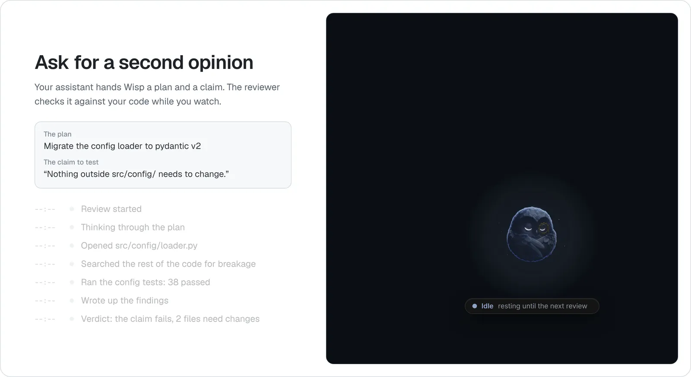
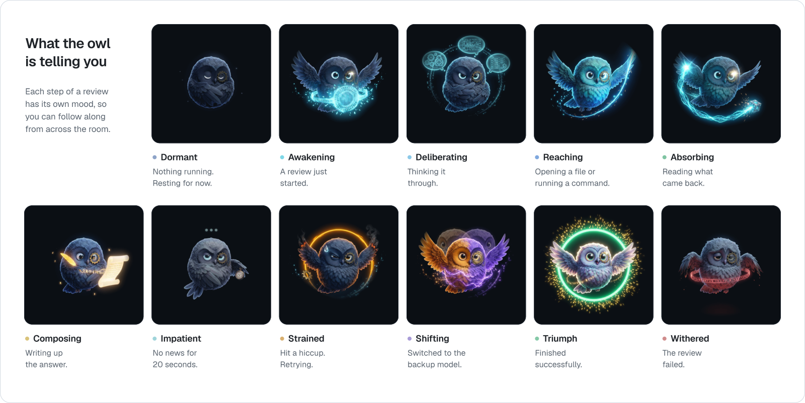
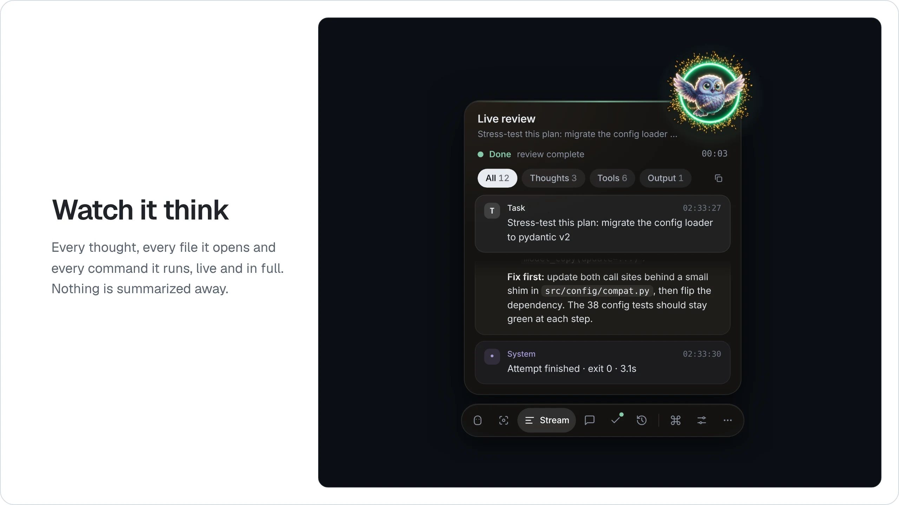
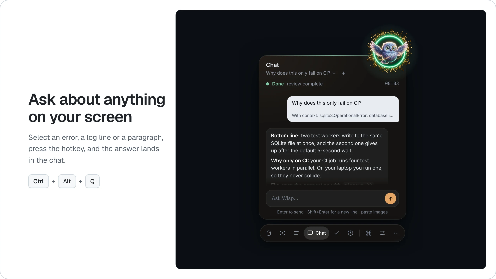
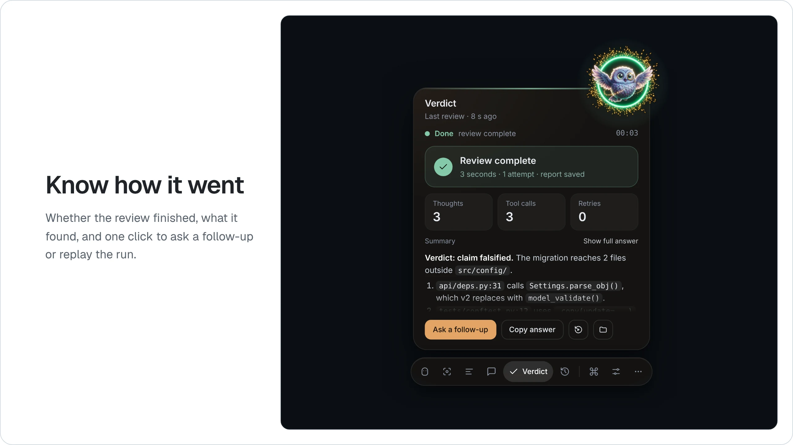
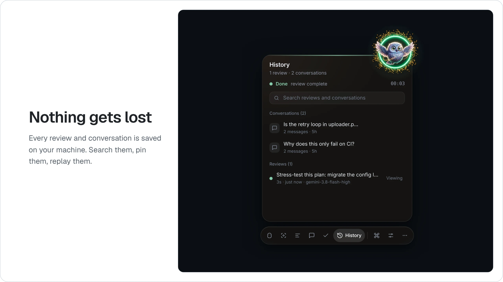
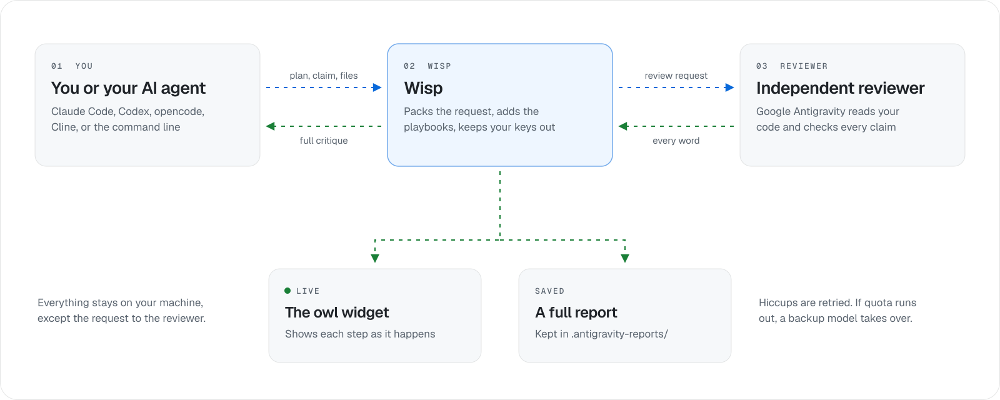

<p align="center">
  <picture>
    <source media="(prefers-color-scheme: dark)" srcset="docs/assets/wisp-hero-dark.svg">
    
  </picture>
</p>

<p align="center">
  <a href="https://github.com/harlixay7/Wisp/actions/workflows/verify.yml"></a>
  
  
  <a href="https://github.com/harlixay7/Wisp/releases/latest"></a>
  <a href="LICENSE"></a>
</p>

<p align="center">
  <a href="#get-started"><b>Get started</b></a>
  &nbsp;&middot;&nbsp;
  <a href="#how-it-works">How it works</a>
  &nbsp;&middot;&nbsp;
  <a href="#connect-your-coding-assistant">Connect your assistant</a>
  &nbsp;&middot;&nbsp;
  <a href="#privacy-and-safety">Privacy</a>
  &nbsp;&middot;&nbsp;
  <a href="#documentation">Docs</a>
</p>

<br>

Coding agents are capable, but they slip in familiar ways. Deep into a long
session they lose the thread: they call a helper that was never written,
rewrite a function that already existed, leave a `TODO` where the logic should
be, or get a calculation quietly wrong. Ask them for a fresh approach and they
often circle back to the first idea they had.

**Wisp is a second set of eyes for your agent.** At the points where those
slips cost the most, it hands the work to an independent reviewer, the
[Google Antigravity CLI](https://antigravity.google), which reads your actual
code and checks it:

- **Plans, before anything is built.** Missing steps, wrong assumptions and
  simpler routes come up while they are still cheap to fix, so the build
  starts from the strongest plan.
- **Claims, against the code.** "This helper already handles empty input",
  "nothing else calls this", "the totals add up": each one is checked against
  the code and the numbers are worked out again, so you know which hold.
- **Changes, before you merge.** It looks for stubs and leftover `TODO`s,
  calls to code that doesn't exist, work that was overwritten, and edge cases
  nobody tested.
- **Ideas, when the agent is stuck.** A second opinion on a design brings
  real alternatives instead of the same answer reworded.

Every finding points to the file and line behind it. Wisp doesn't replace
your own review and tests; it means they start from work that has already
been checked once. While the reviewer works, a small owl on your desktop shows
you what it's doing, and when it's done you get the whole critique, word for
word.

Wisp works with the assistant you already use: Claude Code, Codex, Cursor,
Cline or any other tool that speaks MCP, or straight from the command line.

<p align="center">
  <picture>
    <source media="(prefers-color-scheme: dark)" srcset="docs/assets/wisp-demo-dark.webp">
    
  </picture>
</p>
<p align="center"><sub>A full review in the real app. The task was scripted for this recording; the widget and engine are the shipping code.</sub></p>

## Why it helps

**A reviewer with no stake in the answer.** The reviewer runs as its own
process with its own instructions and a fresh view of your code. It isn't
told the work is good, and it has no reason to agree with your agent.

**Answers come with receipts.** Wisp asks for evidence rather than opinions:
file paths, line numbers, and the output of commands the reviewer actually
ran. You can check any of it yourself in a minute.

**You can see it working.** No spinner and no black box. Every thought, every
file it opens and every command it runs streams into the widget as it happens,
and nothing is cut short.

**Your records stay with you.** The widget only listens on your own computer,
reviews and conversations are saved as files on your disk, and Wisp never
handles your passwords or API keys.

## What the owl is telling you

The owl isn't decoration. It reacts to what the reviewer is doing right now,
so a glance at the corner of your screen tells you whether it's thinking,
reading, writing, stuck, or finished.

<p align="center">
  <picture>
    <source media="(prefers-color-scheme: dark)" srcset="docs/assets/wisp-moods-dark.svg">
    
  </picture>
</p>

## A closer look

The widget has six views. Switch between them from the dock under the panel,
or press <kbd>Ctrl</kbd> + <kbd>K</kbd> to search every action by name.

<p align="center">
  <picture>
    <source media="(prefers-color-scheme: dark)" srcset="docs/assets/wisp-stream-dark.webp">
    
  </picture>
</p>

**Stream** is the full, live record of the review: what the reviewer thought,
which files it opened, which commands it ran and what came back. Filter it
down to thoughts, tool calls or the final answer, and copy any step. **Focus**
is a calmer version that only shows the latest thoughts.

<p align="center">
  <picture>
    <source media="(prefers-color-scheme: dark)" srcset="docs/assets/wisp-chat-dark.webp">
    
  </picture>
</p>

**Chat** is where you talk to it yourself. Highlight anything on your screen
(an error, a log line, a confusing paragraph), press <kbd>Ctrl</kbd> +
<kbd>Alt</kbd> + <kbd>Q</kbd>, and Wisp sends it off and posts the answer
here. <kbd>Ctrl</kbd> + <kbd>Alt</kbd> + <kbd>E</kbd> does the same but lets
you add your own question first. If nothing is selected, you get to snip part
of the screen instead. You can paste screenshots straight into the message
box, and every conversation is saved so follow-up questions keep their
context. The capture hotkeys need Windows and the desktop overlay; on other
systems you type or paste into the chat instead.

<p align="center">
  <picture>
    <source media="(prefers-color-scheme: dark)" srcset="docs/assets/wisp-verdict-dark.webp">
    
  </picture>
</p>

**Verdict** sums up the last run: whether the review finished, how long it
took, how many thoughts and tool calls it made, and a summary of the answer.
**Ask a follow-up** opens the chat with the review as context, and **Replay**
plays the whole run back step by step.

<p align="center">
  <picture>
    <source media="(prefers-color-scheme: dark)" srcset="docs/assets/wisp-history-dark.webp">
    
  </picture>
</p>

**History** keeps your past conversations and reviews, each labelled by what
was asked. Search them, pin the ones you care about, or delete the rest.
Reviews started from any project on your machine show up here, labelled by
project, so it doesn't matter where your assistant was working.

## How it works

<p align="center">
  <picture>
    <source media="(prefers-color-scheme: dark)" srcset="docs/assets/wisp-flow-dark.svg">
    
  </picture>
</p>

1. **You or your assistant ask for a review.** A request is a short note: what
   to look at, any claims you want tested ("this change doesn't touch
   anything outside `src/config/`"), and which files matter.
2. **Wisp prepares it.** It adds the relevant review playbooks (more on those
   below), removes credentials from the environment the reviewer will run
   in, and starts the reviewer in a contained process.
3. **The reviewer does the work.** Wisp uses the
   [Google Antigravity CLI](https://antigravity.google) (`agy`) as the
   reviewer. It can read your project and run commands to check things for
   itself.
4. **Everything comes back.** The complete critique goes back to whoever
   asked, streams live into the widget, and is saved as a report under
   `.antigravity-reports/` in your project. Nothing is trimmed along the way.

A few things happen quietly in the background. If the connection drops or
the reviewer returns nothing, Wisp retries. If you run out of quota on the
main model (`gemini-3.8-flash-high`), it hands the same request to a backup
model (`claude-opus-4-6-thinking`) and carries on. If the run is stopped, the
reviewer and everything it started are shut down together.

## Get started

**You'll need:**

- **Windows 10 or 11, macOS, or Linux.** See [what works where](#what-works-where)
  below.
- **Python 3.10 or newer** and **Git**. On Debian or Ubuntu, also install
  `python3-venv`. On a Mac, the Python that comes with Apple's command-line
  tools may be older than 3.10; setup tells you if it is, and
  [python.org](https://www.python.org/downloads/) or Homebrew has a current one.
- **The [Google Antigravity CLI](https://antigravity.google)** (`agy`),
  signed in with your Google account. Wisp uses your existing sign-in and
  never sees your password. You can install it before or after Wisp; setup
  tells you if it's missing.
- **Node.js 18 or newer** (optional, Windows). With it, the widget floats on
  your desktop as a transparent overlay. Without it, the widget opens in a
  browser window.

### 1. Clone Wisp and run setup

On Windows (you can also double-click `setup.bat`):

```bat
git clone https://github.com/harlixay7/Wisp.git
cd Wisp
setup.bat
```

On macOS or Linux:

```bash
git clone https://github.com/harlixay7/Wisp.git
cd Wisp
./setup.sh
```

Prefer not to use Git? Download the zip from the
[latest release](https://github.com/harlixay7/Wisp/releases/latest), unzip
it, and run the same setup command inside the folder (on macOS or Linux,
`sh setup.sh` works even if the file lost its executable flag).

Setup gets Wisp installed and proves it works. It finds Python (and offers
to install it if there is none), creates a virtual environment in `.venv`,
installs the pinned dependencies, checks the review playbooks and looks for
the Antigravity CLI. If the CLI is missing, it opens the download page and
waits while you install it. Then it runs a self-test that starts the engine
and the MCP server the way your assistant will. On Windows it also installs
the desktop overlay, offering to install Node.js first if needed.

Each step prints `[ok]` or a short note that says what is missing and how to
fix it. If something fails, setup ends with a summary of what went wrong and
what to try, and the full log is in `.wisp-setup.log`.

Setup asks before it installs anything or changes anything outside the Wisp
folder, and it never touches your Antigravity sign-in or your coding
assistant. You can run it again whenever you like.

| Option | What it does |
| --- | --- |
| `--connect` | Connects Claude Code or Codex (asks for each one). See [Connect your coding assistant](#connect-your-coding-assistant). |
| `--yes` | Accepts every offer without asking. |
| `--check` | Reports on your setup without changing anything. |
| `--dev` | Also installs pytest and ruff, then runs the test suite. |
| `--widget` | Installs the desktop overlay on macOS or Linux too (untested there). |
| `--no-widget` | Never installs the desktop overlay. |
| `--recreate-venv` | Deletes `.venv` and builds it again. It refuses to delete a folder that isn't a virtual environment. |

For example, `./setup.sh --check` (or `setup.bat --check`) tells you whether
everything is still in place after you update Python or move the folder.

### 2. Sign in to Antigravity and trust your project

Run `agy` once and follow the prompt to sign in with your Google account.
Then open `agy` once inside each project you want reviewed and accept its
workspace-trust prompt. Until you do, the reviewer isn't allowed to read that
project.

### 3. Open the widget

On Windows:

```bat
tools\antigravity_viewer.cmd
```

On macOS or Linux:

```bash
.venv/bin/python tools/antigravity_viewer.py
```

Without the overlay, the widget opens as a small app window in Edge, Chrome,
Brave or Chromium if you have one of them, and in your default browser
otherwise. On macOS and Linux, stop it with <kbd>Ctrl</kbd> + <kbd>C</kbd>
in the terminal you started it from.

### 4. Run your first review

Point Wisp at one of your projects with `--workspace`. On Windows:

```bat
.venv\Scripts\python tools\antigravity_bridge.py --workspace C:\code\my-app --prompt "Review my plan to upgrade to pydantic v2" --skills plan-review
```

On macOS or Linux:

```bash
.venv/bin/python tools/antigravity_bridge.py --workspace ~/code/my-app --prompt "Review my plan to upgrade to pydantic v2" --skills plan-review
```

Without `--workspace`, Wisp reviews the folder you run the command from. To
sharpen the request, add `--claim "..."` for each statement you want tested
and `--artifact "path/to/file.py"` for each file the reviewer should read
first.

Watch the owl while it runs. The full critique prints in your terminal, and a
complete report is saved in `.antigravity-reports/` inside the project. Add
`--dry-run` to see exactly what would be sent without sending it. That works
even before `agy` is installed.

### What works where

| | Windows 10 / 11 | Linux | macOS |
| --- | --- | --- | --- |
| Setup, reviews, MCP server | Yes | Yes | Yes |
| Widget in a browser window | Yes | Yes | Yes |
| Transparent desktop overlay | Yes (installed by default) | With `--widget`, untested | With `--widget`, untested |
| Screen-capture hotkeys | Yes, with the overlay | No | No |
| Checked in CI on every change | Setup and full test suite | Setup and full test suite | Setup only |

Wisp is built and used on Windows. On Linux, the engine, the MCP server
and the widget work, and the test suite runs on Ubuntu for every change. On
macOS, CI runs the setup from a clean checkout, but the test suite doesn't run
there and nobody has tried Wisp on a real Mac yet. If you do, please
[tell us how it went](https://github.com/harlixay7/Wisp/issues/new/choose).

## Connect your coding assistant

Wisp speaks the [Model Context Protocol](https://modelcontextprotocol.io), the
standard way coding assistants call outside tools. Connecting an assistant
takes two steps: register Wisp's MCP server, which gives the assistant the
review tools, and install the delegation skill, which tells it when to ask for
a review and how to act on the answer.

The easiest way is `setup.bat --connect` (or `./setup.sh --connect`). It finds
Claude Code and Codex if you have them and asks before connecting each one:
it registers the MCP server, installs the delegation skill for Claude Code,
and adds the Codex entry (keeping a backup of your Codex config). For any
other assistant it prints the entry to paste, with the full paths on your
machine filled in. Restart your assistant afterwards, because assistants only
load MCP servers when they start.

The paths have to be absolute. Your assistant starts the server from whatever
project it's working in, so a relative path such as
`tools/antigravity_mcp_server.py` only works inside the Wisp folder. In the
examples below, `<wisp>` stands for the folder you cloned Wisp into.

**Claude Code.** Register the server for every project:

```bash
claude mcp add --scope user antigravity -e ANTIGRAVITY_HARNESS=claude-code -- \
  <wisp>/.venv/bin/python <wisp>/tools/antigravity_mcp_server.py
```

On Windows the Python path is `<wisp>\.venv\Scripts\python.exe`. Then copy
the delegation skill into your skills folder:

```bash
mkdir -p ~/.claude/skills
cp -R <wisp>/integrations/antigravity-delegation ~/.claude/skills/
```

[docs/integrations.md](docs/integrations.md#claude-code) has the PowerShell
version and the per-project location.

**Codex, Cline, Cursor, Roo Code, opencode and others** each take a short
config entry. [docs/integrations.md](docs/integrations.md) has the entry and
the skill location for each one. Assistants without MCP support, such as
Aider, can run the command from [step 4](#4-run-your-first-review) instead.

The server reviews the folder your assistant is working in. Your assistant
can name a different folder in the `workspace` field of a request, or you can
pin one by adding `ANTIGRAVITY_WORKSPACE` to the registration's environment.

Once it's registered, your assistant gets three tools:

| Tool | What it does |
| --- | --- |
| `antigravity_review` | Runs a review and returns the complete critique. Only `prompt` is required. |
| `antigravity_status` | Checks that the reviewer is installed and the playbooks are valid. |
| `antigravity_skills` | Lists the available review playbooks. |

A request from your assistant looks like this:

```json
{
  "prompt": "Harden this plan before we build it: ...",
  "claims_to_falsify": ["Stopping the parent process stops every child within 500 ms"],
  "artifacts": ["src/supervisor.py:45-120"],
  "skills": ["plan-review"]
}
```

For a complete, realistic request, see
[examples/delegation-case-study.json](examples/delegation-case-study.json).
[docs/delegation-playbook.md](docs/delegation-playbook.md) covers how to write
requests that get sharp answers instead of polite agreement.

## Review playbooks

Wisp ships with seventeen playbooks, which the code calls *skills*. Each is a
written procedure the reviewer follows, with its own checklist, its own rules
about what counts as evidence, and a clear definition of when the work passes
or should be blocked. Every playbook reports findings in the same format and
ends with the same verdict, so your agent can act on the answer point by point.
Pick the one that fits the job.

<details>
<summary><b>See all seventeen playbooks</b></summary>
<br>

| Playbook | Reach for it when |
| --- | --- |
| `pre-merge-review` | A change is ready and you want it checked before it's committed or merged |
| `root-cause-investigation` | Two fixes have failed and you need the real cause, not another guess |
| `plan-review` | You have a plan or design and want it attacked before anyone builds it |
| `design-second-opinion` | You want a second mind to solve the problem independently and recommend an approach |
| `wiring-audit` | You want proof that the code is really connected the way it claims |
| `safe-implementation` | You want the reviewer to make the change itself, test first, without breaking anything |
| `data-integrity-review` | Schemas, migrations, saved data or transactions are changing |
| `security-review` | Untrusted input, secrets, permissions or agent tools are involved |
| `claim-check` | Someone made a speed, cost or accuracy claim that needs re-checking |
| `performance-profiling` | Something is slow, stalls, or eats memory |
| `agent-workflow-review` | You're designing tool calls or multi-step agent workflows |
| `prompt-review` | A prompt, system prompt, AGENTS.md or skill needs to be sharper |
| `ai-eval-review` | You're changing prompts or models and need evidence before shipping |
| `rag-review` | You're building search or retrieval for an AI system |
| `ui-review` | A UI change needs a careful review of craft, accessibility and motion |
| `docs-accuracy-review` | The docs may no longer match what the code does |
| `portability-review` | The project should work on someone else's machine, not just yours |

You can write your own: add a Markdown file to `Skills/` and check it with
`python -m tools.skill_loader --validate`. The format is described in
[CONTRIBUTING.md](CONTRIBUTING.md#adding-a-review-playbook).

</details>

## Privacy and safety

- **The widget is local.** It listens on `127.0.0.1`, port 48477 (or the
  next free port), and refuses to bind to any other address unless you set
  an access token.
- **What Wisp saves stays on your disk.** Everything goes into a
  `.antigravity-reports/` folder: review reports in the project that was
  reviewed, and widget chats and screenshots in the folder the widget runs
  from (the Wisp folder, if you start it as shown above). Reports contain
  your full requests, so add `.antigravity-reports/` to your project's
  `.gitignore`. What leaves your machine is what the reviewer sends to its
  model: your request and whatever files it reads while checking.
- **Credentials are left out.** Before starting the reviewer, Wisp removes
  credential variables from its environment: cloud keys, GitHub and SSH
  tokens, OpenAI, Anthropic and Hugging Face keys, and similar.
- **Nothing is left running.** The reviewer runs inside a Windows Job Object
  (a process group on macOS and Linux), so stopping a review stops everything
  it started.

To be clear about what this means: it's careful housekeeping, not a sandbox.
The reviewer can read your project and run commands without asking first,
because that's how it checks claims. Only point Wisp at projects whose code
you'd be comfortable running yourself. [SECURITY.md](SECURITY.md) has the
full details.

## Good to know

- **Wisp is an independent project.** It isn't made by or affiliated with
  Google. It runs the Google Antigravity CLI that you install and sign in to
  yourself, and works with whichever models your Antigravity account offers.
- **Very large requests can hit a Windows limit.** The request travels on
  the `agy` command line, which Windows caps at 32,767 characters. Wisp stops
  a little before that, with a message saying what to shorten. Moving long
  material into files and listing them as artifacts fixes it.
- **It uses your Antigravity quota.** Every review counts against your Google
  account's limits. When the main model runs out, Wisp switches to the backup
  model and tells you so.
- **Switching Google accounts from the widget is Windows-only.** Elsewhere,
  switch accounts through `agy` itself.

## For contributors

The test suite runs offline and never calls the real reviewer, so it costs no
quota and needs no Google account. CI runs it on Windows and Ubuntu with
Python 3.10 and 3.13.

`./setup.sh --dev` (or `setup.bat --dev`) installs the test tools and runs
the suite. After that:

```bash
python -m pytest tests/ -q                # 475 test cases
ruff check .                              # lint
python -m tools.skill_loader --validate   # check the playbooks
```

Use the Python inside `.venv`, or activate it first.
[CONTRIBUTING.md](CONTRIBUTING.md) covers the rest, and everyone taking part is expected to follow the
[code of conduct](CODE_OF_CONDUCT.md). Please report security problems
privately, as described in [SECURITY.md](SECURITY.md#reporting-a-vulnerability).

## Documentation

| Document | What's inside |
| --- | --- |
| [docs/integrations.md](docs/integrations.md) | Connecting each assistant, server settings, every command-line option, troubleshooting |
| [docs/delegation-playbook.md](docs/delegation-playbook.md) | How to write requests that get useful answers |
| [integrations/antigravity-delegation/SKILL.md](integrations/antigravity-delegation/SKILL.md) | The delegation skill your assistant follows: when to ask, what to send, how to answer findings |
| [AGENTS.md](AGENTS.md) | Notes for AI agents working on Wisp itself |
| [CONTRIBUTING.md](CONTRIBUTING.md) | How to set up a development copy and send a change |
| [SECURITY.md](SECURITY.md) | What is contained, what isn't, and how to report a problem |
| [CODE_OF_CONDUCT.md](CODE_OF_CONDUCT.md) | How we expect people to treat each other here |
| [CHANGELOG.md](CHANGELOG.md) | What changed in each release |

## License

Wisp is released under the [MIT License](LICENSE).
