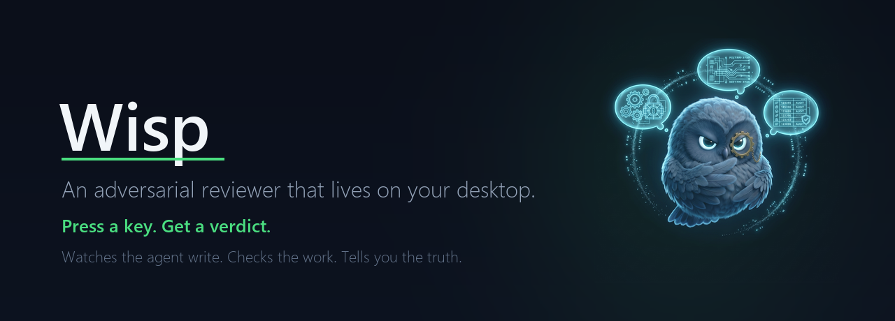
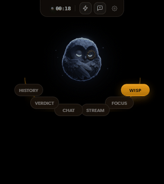
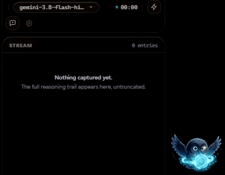
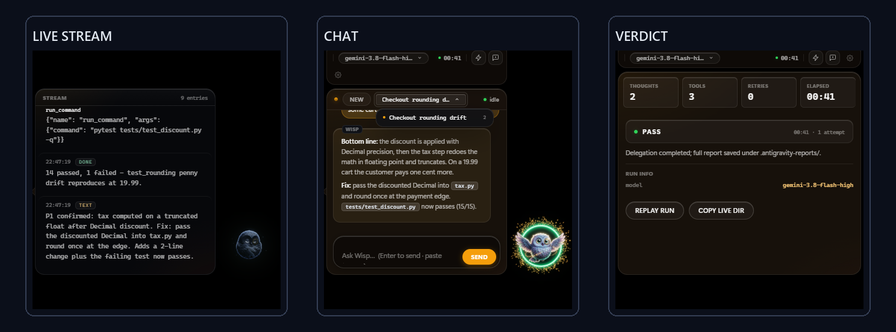
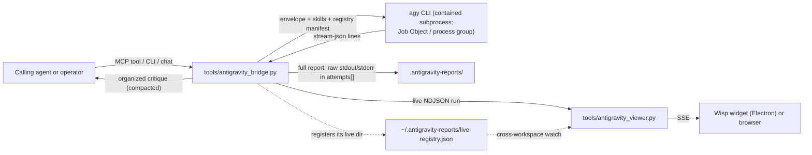

# Wisp



An AI agent writes your code. **Wisp is the reviewer standing behind it.**

It watches your coding agent work in real time, stress-tests its plans before
a line is written, and hands you a plain-language verdict when it's done —
pass, fail, or "here's what to fix first." All of it runs on your machine,
against your repository, with your keys.


[](LICENSE)

---

## Why Wisp exists

Here's the uncomfortable part of AI-assisted coding: the agent that wrote the
code is the least qualified to judge it. It is optimistic by nature, it grades
its own homework, and it moves fast enough that you can't check every step.

Wisp fixes that with a second opinion that has no stake in the answer. It
takes your agent's plans and finished work, hands them to an independent
adversarial reviewer, and makes the reviewer *prove* its claims — with file
paths, line numbers, and executed commands, not vibes.

You get one of three answers: **this is sound**, **this breaks under these
conditions, here's the fix**, or **stop — this needs a different approach**.
Every finding comes with evidence you can check yourself.

## See it work

The reviewer lives in a small desktop creature that reacts to what the agent
is doing — thinking while it reasons, celebrating when the work holds up:



While the agent works, the reasoning streams past live — thoughts, tool
calls, results — nothing summarized away:



And when it finishes, you get the verdict card with the numbers that matter,
next to the live stream and your chat history:



## Highlights

### Press a key, get an answer

Select any text anywhere — an error message, a stack trace, a paragraph you
don't understand — press **Ctrl+Alt+Q**, and Wisp captures it, asks the
reviewer, and posts the answer straight into your chat. No window switching,
no copy-paste. **Ctrl+Alt+E** does the same but lets you add your own
question first.

### The chat remembers the thread

Every question and answer is kept in a persistent conversation, so follow-ups
have context. Paste screenshots next to your question — Wisp attaches them to
the delegation so the reviewer can look at what you're looking at.

### A reviewer with standards

Delegations aren't vague "review my code" requests. Wisp ships twelve
adversarial skills — plan hardening, wiring audits, claim falsification,
security review, and more — that are injected into every review, along with
*your* claims to falsify and the exact files to inspect. The reviewer must
cite evidence; unverifiable praise is rejected, not passed along.

### Works with your existing setup

Wisp speaks [Model Context Protocol](https://modelcontextprotocol.io), so any
MCP-capable coding agent — Claude Code, opencode, Codex, Cline, Cursor,
Aider — can call it as a tool. Register it once and your agent can delegate
reviews whenever it needs a second opinion.

### Local first, honest about limits

Everything runs on your machine: the viewer binds to loopback, chat history
and reports stay under your workspace, and the agent runs inside a
process-containment boundary with a sanitized environment. It is *containment,
not a sandbox* — the full trust model is in [SECURITY.md](SECURITY.md).

## How a delegation works

```
You (or your agent) write a delegation envelope
        │  prompt · context · claims to falsify · files to inspect · skills
        ▼
Wisp bridge ── builds the payload, picks the skills, sanitizes the environment
        │
        ▼
Antigravity CLI ── an independent senior reviewer, spawned as a contained
        │           subprocess with read access to your workspace
        ▼
Complete critique ── every raw byte captured, streamed live to the widget,
        │            and persisted as a JSON forensic report
        ▼
You reconcile ── every objection gets a verdict: accepted (with a fix) or
                 rejected (with counter-evidence). No silent dismissals.
```

Under the hood, the same flow looks like this:



The bridge retries transient failures, fails over to a fallback model on
quota exhaustion, and persists one complete JSON report per delegation. The
MCP server is a thin stdio wrapper over the same engine; the viewer is
optional and read-only with respect to the engine.

## Quickstart

**Windows**

```bat
git clone https://github.com/harlixay7/Wisp.git
cd Wisp
setup.bat
tools\antigravity_viewer.cmd
```

`setup.bat` creates the virtual environment, installs dependencies, checks
the Antigravity CLI, validates the skill registry, and runs the test suite.
The viewer opens the desktop widget.

**macOS / Linux**

```bash
git clone https://github.com/harlixay7/Wisp.git
cd Wisp
python3 -m venv .venv && . .venv/bin/activate
pip install -r requirements-dev.txt
python -m tools.skill_loader --validate
python -m pytest tests/ -q
python tools/antigravity_bridge.py --status
```

The desktop widget needs Windows (transparent overlay + global hotkeys); on
macOS and Linux the viewer, bridge, and MCP server work headless.

**Prerequisite:** the [Google Antigravity CLI](https://antigravity.google)
(`agy`), installed and signed in. Wisp delegates to it and never handles your
credentials itself.

### Your first delegation

```bash
python tools/antigravity_bridge.py \
  --prompt "Stress-test this plan: migrate the config loader to pydantic v2" \
  --context "Python 3.11, 467 tests green, config lives in src/config/" \
  --claim "The migration requires zero changes outside src/config/" \
  --artifact "src/config/loader.py:40-110" \
  --skills adversarial-plan-hardening-engine
```

You'll get the full critique on stdout and a complete JSON report on disk.
If you'd rather look before running: add `--dry-run` to print the exact
command, or `--list-skills` to see the registry.

## Register it with your coding agent

```bash
claude mcp add antigravity -- python tools/antigravity_mcp_server.py
```

Other harnesses (opencode, Codex, Cline, Cursor) are one config entry each —
the exact snippets are in [AgentSkill.md](AgentSkill.md). Once registered,
your agent can call `antigravity_review` with a prompt, the files to inspect,
and the claims to falsify:

```json
{
  "prompt": "Harden this plan before execution: ...",
  "claims_to_falsify": [
    "Terminating the parent kills all descendants within 500ms"
  ],
  "artifacts": ["src/supervisor.py:45-120"],
  "skills": ["adversarial-plan-hardening-engine"]
}
```

A worked, end-to-end example — including what the reviewer found — is in
[examples/delegation-case-study.json](examples/delegation-case-study.json),
and [docs/delegation-playbook.md](docs/delegation-playbook.md) explains how
to write delegations that get sharp answers instead of polite nods.

## The skill registry

Twelve adversarial skills ship with the repository. Each one is a full
operating procedure the reviewer must follow — evidence requirements,
verdict formats, and hard prohibitions:

| Skill | Use it when |
| --- | --- |
| `adversarial-plan-hardening-engine` | Before implementing a plan or architecture |
| `zero-trust-ast-wiring-verifier` | Auditing code wiring, stubs, and call graphs |
| `empirical-claim-falsification-engine` | Recomputing performance and hardware claims |
| `zero-regression-surgical-implementation` | Fixing bugs without breaking contracts |
| `data-contract-state-integrity-engine` | Reviewing schemas, migrations, transactions |
| `ai-eval-regression-engine` | Building eval suites for prompts and agents |
| `runtime-security-vault-engine` | Auditing tool surfaces, secrets, injection |
| `telemetry-hardware-profiling-gate` | Profiling stalls, memory, and contention |
| `git-hygiene-portability-gate` | Checking packaging and clone portability |
| `documentation-retraction-ledger-engine` | Keeping docs truthful to the code |
| `hybrid-rag-retrieval-grounding-engine` | Reviewing RAG chunking and retrieval |
| `agentic-tool-dag-orchestration-engine` | Auditing MCP tools and agent loops |

## Verification

The suite is deterministic and offline — no real API calls, no quota:

```bash
python -m pytest tests/ -q          # full suite
ruff check tools tests              # lint
python -m tools.skill_loader --validate
```

Continuous integration runs the same stack on Windows and Ubuntu across
Python 3.10 and 3.13.

## Documentation

| Document | What's inside |
| --- | --- |
| [AgentSkill.md](AgentSkill.md) | Master deployment guide: every harness, every flag |
| [docs/delegation-playbook.md](docs/delegation-playbook.md) | How to write delegations that get sharp answers |
| [AGENTS.md](AGENTS.md) | The delegation contract for coding agents |
| [SECURITY.md](SECURITY.md) | Trust model: what's contained, what isn't |
| [CHANGELOG.md](CHANGELOG.md) | Release history |
| [examples/delegation-case-study.json](examples/delegation-case-study.json) | A real delegation envelope, end to end |

## Known limitations

- The desktop widget (transparent overlay, global hotkeys) is Windows-only.
  On macOS and Linux the viewer runs in a normal browser tab and the bridge,
  MCP server, and viewer work as usual.
- The delegation payload travels on the `agy` command line, and Windows caps
  command lines at ~32,767 characters. Rendered skill instructions count
  toward that, so very long prompts combined with multiple active skills can
  hit it — the bridge fails fast with an actionable message instead of a
  cryptic OS error.
- Wisp contains the reviewer's *process tree*, not its *authority*. The
  reviewer can read your workspace and run commands within its grants. If
  that worries you for a given repo, don't point Wisp at repos whose build
  you wouldn't run yourself.

## License

[MIT](LICENSE)
