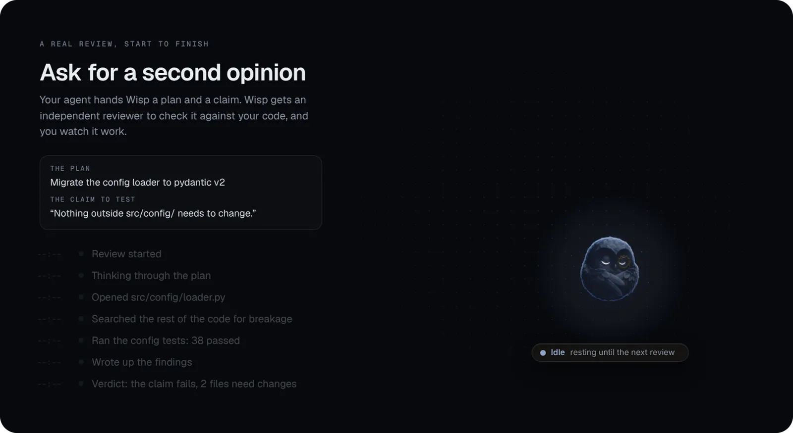
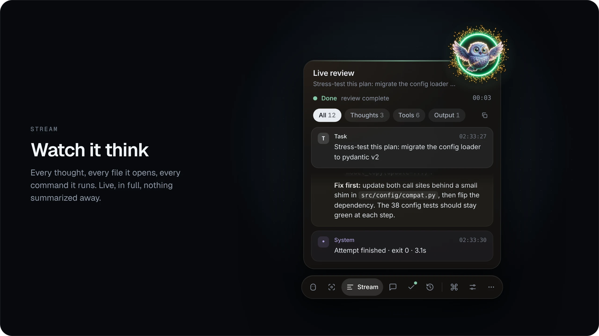
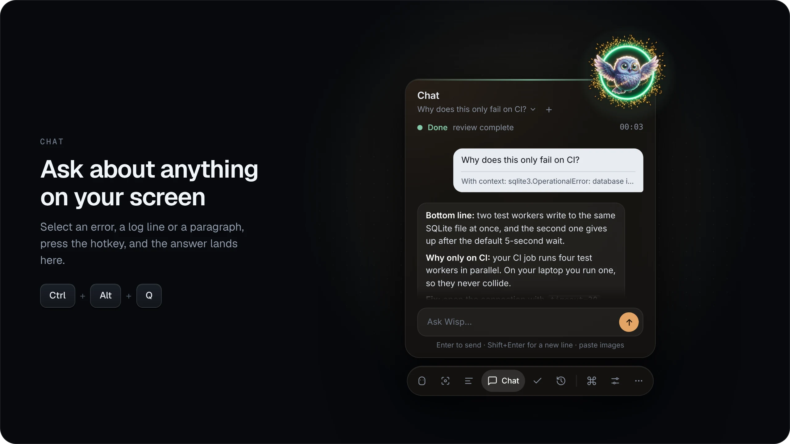
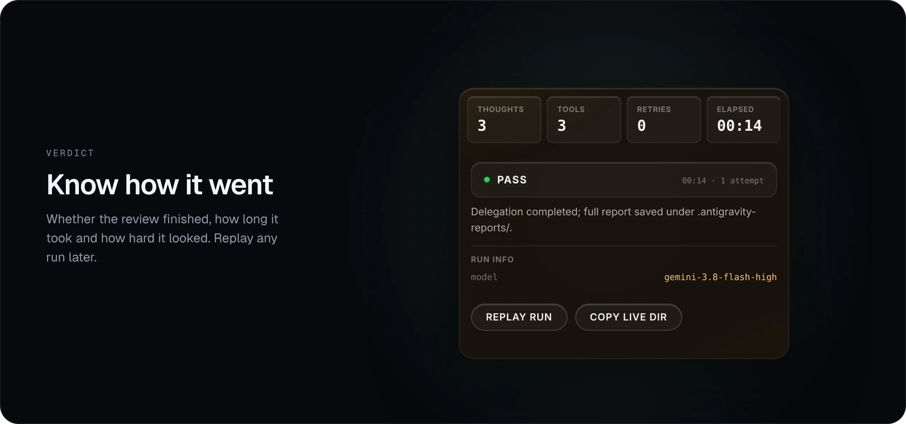
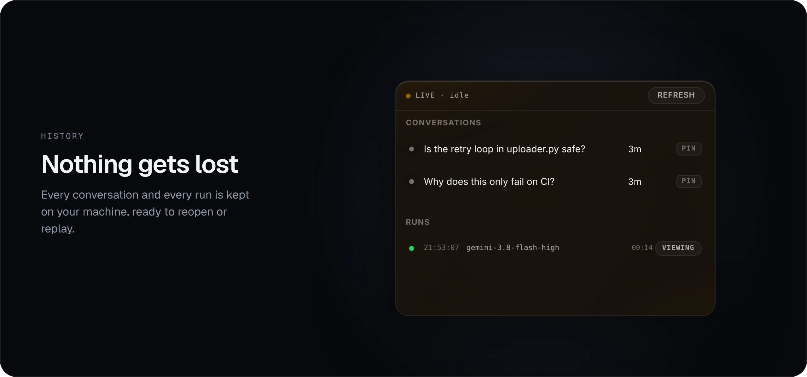

<p align="center">
  
</p>

<p align="center">
  <a href="https://github.com/harlixay7/Wisp/actions/workflows/ci.yml"></a>
  
  
  <a href="LICENSE"></a>
</p>

<p align="center">
  <a href="#get-started"><b>Get started</b></a>
  &nbsp;&middot;&nbsp;
  <a href="#how-it-works">How it works</a>
  &nbsp;&middot;&nbsp;
  <a href="#register-the-mcp-server">Connect your agent</a>
  &nbsp;&middot;&nbsp;
  <a href="#privacy-and-safety">Privacy</a>
  &nbsp;&middot;&nbsp;
  <a href="#documentation">Docs</a>
</p>

<br>

AI coding assistants are fast, and they are usually confident. The catch is
that the same assistant that wrote the code is also the one telling you it
works. It is grading its own homework.

**Wisp gives you a second opinion.** When your coding assistant has a plan or
a finished change, Wisp hands it to a separate AI reviewer whose only job is
to find what's wrong. The reviewer reads your actual code, runs checks, and
has to point to the file and line behind every finding. While it works, a
small owl on your desktop shows you what it's doing, and when it's done you
get the whole critique, word for word.

<p align="center">
  
</p>
<p align="center"><sub>A full review in the real app. The task was scripted for this recording; the widget and engine are the shipping code.</sub></p>

## Why it helps

**Someone checks the work who didn't write it.** The reviewer runs as its own
process with its own instructions. It isn't told the code is good and has no
reason to agree with your assistant.

**Answers come with receipts.** Wisp asks for evidence rather than opinions:
file paths, line numbers, and the output of commands the reviewer actually
ran. You can check any of it yourself in a minute.

**You can see it working.** No spinner and no black box. Every thought, every
file it opens and every command it runs streams into the widget as it happens,
and nothing is cut short.

**It stays on your machine.** The widget only listens on your own computer,
your conversations and reports are saved inside your project, and Wisp never
handles your passwords or API keys.

## What the owl is telling you

The owl isn't decoration. It reacts to what the reviewer is doing right now,
so a glance at the corner of your screen tells you whether it's thinking,
reading, writing, stuck, or finished.

<p align="center">
  
</p>

## A closer look

The widget has six views, and the tabs across its top switch between them.
On the main **Wisp** view, the same six float around the owl as buttons.

<p align="center">
  
</p>

**Stream** is the full, live record of the review: what the reviewer thought,
which files it opened, which commands it ran and what came back. **Focus**
is a calmer version that only shows the latest thoughts.

<p align="center">
  
</p>

**Chat** is where you talk to it yourself. Highlight anything on your screen
(an error, a log line, a confusing paragraph), press <kbd>Ctrl</kbd> +
<kbd>Alt</kbd> + <kbd>Q</kbd>, and Wisp sends it off and posts the answer
here. <kbd>Ctrl</kbd> + <kbd>Alt</kbd> + <kbd>E</kbd> does the same but lets
you add your own question first. If nothing is selected, you get to snip part
of the screen instead. You can paste screenshots straight into the message
box, and every conversation is saved so follow-up questions keep their
context. The capture hotkeys work on Windows.

<p align="center">
  
</p>

**Verdict** sums up the last run: whether the review finished, how long it
took, how many thoughts and tool calls it made, and whether anything had to
be retried. **Replay run** plays the whole thing back step by step.

<p align="center">
  
</p>

**History** keeps your past conversations and runs. Pin the ones you care
about. Reviews started from any project on your machine show up here,
labelled by project, so it doesn't matter where your assistant was working.

## How it works

<p align="center">
  <picture>
    <source media="(prefers-color-scheme: dark)" srcset="docs/assets/wisp-flow-dark.svg">
    
  </picture>
</p>

1. **You or your assistant ask for a review.** A request is a short note: what
   to look at, any claims you want tested ("this change doesn't touch
   anything outside `src/config/`"), and which files matter.
2. **Wisp prepares it.** It adds the relevant review playbooks (more on those
   below), removes credentials from the environment the reviewer will run
   in, and starts the reviewer in a contained process.
3. **The reviewer does the work.** Wisp uses the
   [Google Antigravity CLI](https://antigravity.google) (`agy`) as the
   reviewer. It can read your project and run commands to check things for
   itself.
4. **Everything comes back.** The complete critique goes back to whoever
   asked, streams live into the widget, and is saved as a report under
   `.antigravity-reports/` in your project. Nothing is trimmed along the way.

A few things happen quietly in the background. If the connection drops or
the reviewer returns nothing, Wisp retries. If you run out of quota on the
main model (`gemini-3.8-flash-high`), it hands the same request to a backup
model (`claude-opus-4-6-thinking`) and carries on. If the run is stopped, the
reviewer and everything it started are shut down together.

## Get started

**You'll need:**

- **Windows 10 or 11.** The engine also runs on Linux; see the note below.
- **Python 3.10 or newer.**
- **The [Google Antigravity CLI](https://antigravity.google)**, installed and
  signed in with your Google account. Wisp uses your existing sign-in and
  never sees your password.
- **Node.js** (optional). With it, the widget floats on your desktop as a
  transparent overlay. Without it, the widget opens in a browser window.

**Install and run on Windows:**

```bat
git clone https://github.com/harlixay7/Wisp.git
cd Wisp
setup.bat
tools\antigravity_viewer.cmd
```

`setup.bat` does the setup for you. It checks your Python version, creates a
virtual environment, installs the dependencies, finds the Antigravity CLI,
validates the review playbooks, runs the test suite, and installs the desktop
widget if Node.js is available. The last line opens the owl.

The first time, open `agy` once in your project folder and accept its
workspace-trust prompt, so the reviewer is allowed to read your code.

**Your first review:**

```bat
.venv\Scripts\python tools\antigravity_bridge.py --prompt "Review my plan to upgrade to pydantic v2" --skills adversarial-plan-hardening-engine
```

To sharpen it, add `--claim "..."` for each statement you want tested and
`--artifact "path/to/file.py"` for each file the reviewer should read first.

Watch the owl while it runs. The full critique prints in your terminal and a
complete report is saved in `.antigravity-reports/`. Add `--dry-run` to see
exactly what would be sent without sending it.

> [!NOTE]
> **On Linux,** the engine, the MCP server and the viewer all run, and the
> continuous-integration tests run on Ubuntu as well as Windows. The
> screen-capture hotkeys are Windows-only, and the desktop overlay hasn't
> been tested off Windows. macOS isn't tested at all yet.
>
> ```bash
> python3 -m venv .venv && . .venv/bin/activate
> pip install -r requirements-dev.txt
> python tools/antigravity_bridge.py --status
> ```

## Register the MCP server

Wisp speaks the [Model Context Protocol](https://modelcontextprotocol.io), the
standard way coding assistants call outside tools. Register it once and your
assistant can ask for a review whenever it wants a second opinion.

**Claude Code**

```bash
claude mcp add antigravity -- python tools/antigravity_mcp_server.py
```

**opencode** picks it up automatically from the `opencode.json` in this
repository. Ready-made entries for **Codex**, **Cline**, **Cursor** and
**Roo Code** are in [AgentSkill.md](AgentSkill.md#32-mcp-registration-per-harness).
Assistants without MCP support, such as Aider, can call the command line
shown above instead.

Once it's registered, your assistant gets three tools:

| Tool | What it does |
| --- | --- |
| `antigravity_review` | Runs a review and returns the complete critique. Only `prompt` is required. |
| `antigravity_status` | Checks that the reviewer is installed and the playbooks are valid. |
| `antigravity_skills` | Lists the available review playbooks. |

A request from your assistant looks like this:

```json
{
  "prompt": "Harden this plan before we build it: ...",
  "claims_to_falsify": ["Stopping the parent process stops every child within 500 ms"],
  "artifacts": ["src/supervisor.py:45-120"],
  "skills": ["adversarial-plan-hardening-engine"]
}
```

For a complete example, including what the reviewer found, see
[examples/delegation-case-study.json](examples/delegation-case-study.json).
[docs/delegation-playbook.md](docs/delegation-playbook.md) covers how to write
requests that get sharp answers instead of polite agreement.

## Review playbooks

Wisp ships with twelve playbooks, which the code calls *skills*. Each is a
written procedure the reviewer has to follow, with its own rules about what
counts as evidence and what a finished answer looks like. Pick the ones that
fit the job, or pass `--skills all`.

<details>
<summary><b>See all twelve playbooks</b></summary>
<br>

| Playbook | Reach for it when |
| --- | --- |
| `adversarial-plan-hardening-engine` | You have a plan or design and want it attacked before anyone builds it |
| `zero-trust-ast-wiring-verifier` | You want proof that the code is really connected the way it claims |
| `empirical-claim-falsification-engine` | Someone made a speed, memory or hardware claim that needs re-checking |
| `zero-regression-surgical-implementation` | You're fixing a bug and can't afford to break anything else |
| `data-contract-state-integrity-engine` | Schemas, migrations, saved data or transactions are changing |
| `ai-eval-regression-engine` | You're changing prompts or models and need tests to catch regressions |
| `runtime-security-vault-engine` | Tools, secrets, file access or prompt injection are in play |
| `telemetry-hardware-profiling-gate` | Something is slow, stalls, or eats memory |
| `git-hygiene-portability-gate` | The project should work on someone else's machine, not just yours |
| `documentation-retraction-ledger-engine` | The docs may no longer match what the code does |
| `hybrid-rag-retrieval-grounding-engine` | You're building search or retrieval for an AI system |
| `agentic-tool-dag-orchestration-engine` | You're designing tool calls or multi-step agent workflows |

You can write your own: add a YAML or Markdown file to `Skills/` and check it
with `python -m tools.skill_loader --validate`. The format is described in
[AGENTS.md](AGENTS.md#6-skill-registry).

</details>

## Privacy and safety

- **The widget is local.** It listens on `127.0.0.1` (port 48477) and
  refuses to bind to any other address unless you set an access token.
- **Your files stay put.** Conversations, screenshots and reports are saved
  under `.antigravity-reports/` inside your project. The only thing that
  leaves your machine is the review request sent to Google Antigravity.
- **Credentials are left out.** Before starting the reviewer, Wisp removes
  credential variables from its environment: cloud keys, GitHub and SSH
  tokens, OpenAI, Anthropic and Hugging Face keys, and similar.
- **Nothing is left running.** The reviewer runs inside a Windows Job Object
  (a process group on Linux), so stopping a review stops everything it
  started.

Be clear about what this means, though. It's careful housekeeping, not a
sandbox. The reviewer can read your project and run commands without asking
first, because that's how it checks claims. Only point Wisp at projects whose
code you'd be comfortable running yourself. [SECURITY.md](SECURITY.md) has
the full details.

## Good to know

- **It's built for Windows first.** The screen-capture hotkeys are
  Windows-only, and the desktop overlay is only tested there.
- **Very large requests can hit a Windows limit.** The request travels on
  the `agy` command line, which Windows caps at about 32,000 characters.
  Long prompts combined with many playbooks can reach it, and Wisp stops with
  a clear message when they do.
- **It uses your Antigravity quota.** Every review counts against your Google
  account's limits. When the main model runs out, Wisp switches to the backup
  model and tells you so.

## For contributors

The test suite runs offline and never calls the real reviewer, so it costs no
quota. Continuous integration runs it on Windows and Ubuntu with Python 3.10
and 3.13.

```bash
python -m pytest tests/ -q                # 322 test cases
ruff check tools tests                    # lint
python -m tools.skill_loader --validate   # check the playbooks
```

## Documentation

| Document | What's inside |
| --- | --- |
| [AgentSkill.md](AgentSkill.md) | Setup for every supported assistant and every command-line option |
| [docs/delegation-playbook.md](docs/delegation-playbook.md) | How to write requests that get useful answers |
| [AGENTS.md](AGENTS.md) | The rules coding assistants follow when they delegate to Wisp |
| [SECURITY.md](SECURITY.md) | What is contained, what isn't, and how to report a problem |
| [CHANGELOG.md](CHANGELOG.md) | What changed in each release |

## License

Wisp is released under the [MIT License](LICENSE).
